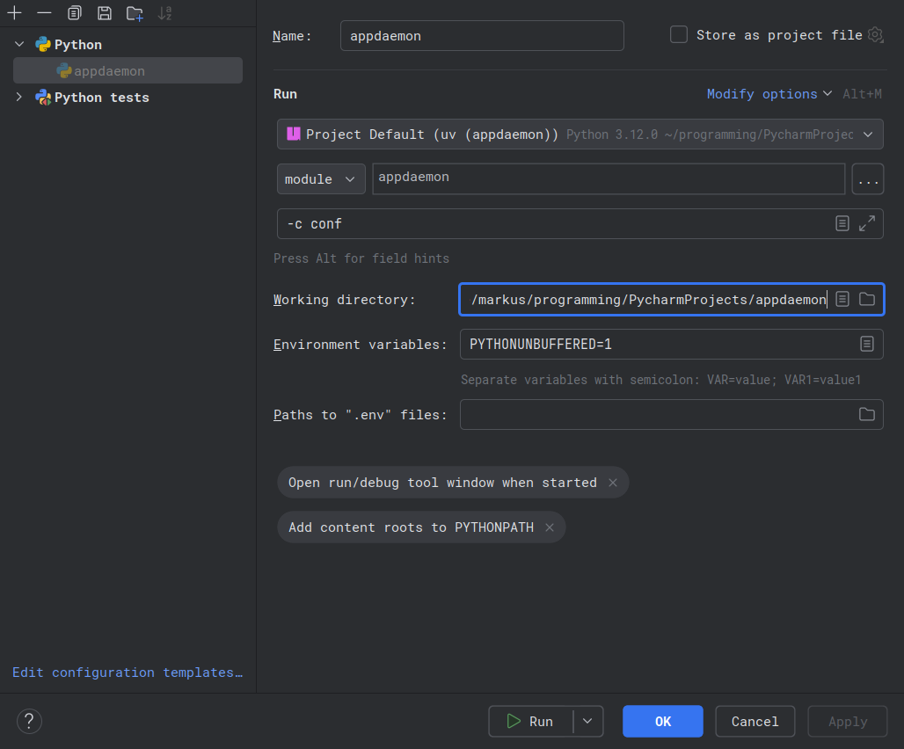
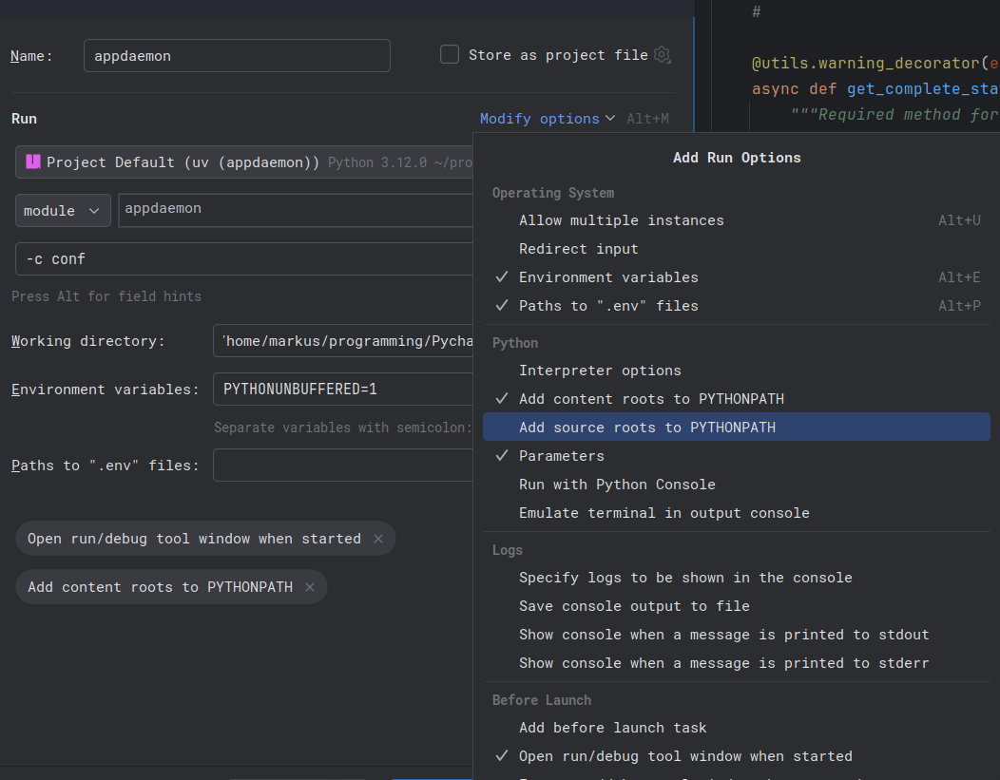

Development
===========
If you would like to improve AppDaemon, we are pleased to receive Pull Requests in `the official AppDaemon repository <https://github.com/AppDaemon/appdaemon>`_. Here are a few things to help you get started.

Please note, if some documentation is required to make sense of the PR, the PR will not be accepted without it.

Tools
-----
Although it's certainly possible to use other tools for any of this, these are what's used by the contributors.

Python
^^^^^^

`uv <https://docs.astral.sh/uv/>`_
  An extremely fast Python package and project manager, written in Rust.
`ruff <https://docs.astral.sh/ruff/>`_
  An extremely fast Python linter and code formatter, written in Rust.
`pytest <https://docs.pytest.org/en/stable/>`_
  The pytest framework makes it easy to write small, readable tests, and can scale to support complex functional testing for applications and libraries.
`pre-commit <https://pre-commit.com/>`_
  A framework for managing and maintaining multi-language pre-commit hooks. Once enabled, these run things like the linter on every commit.
`sphinx <https://www.sphinx-doc.org/en/master/>`_ for `readthedocs <https://docs.readthedocs.com/platform/stable/intro/sphinx.html>`_
  Sphinx is a powerful documentation generator that has many features for writing technical documentation. Sphinx is written in Python, and supports documentation written in reStructuredText and Markdown.

IDEs
----

`VSCode <https://code.visualstudio.com/docs>`_
^^^^^^^^^^^^^^^^^^^^^^^^^^^^^^^^^^^^^^^^^^^^^^
The AppDaemon repo itself contains some configuration specifically for VSCode, which makes some routine tasks easier.

`Python <https://code.visualstudio.com/docs/python/python-quick-start>`_
  The Python extension makes Visual Studio Code an excellent Python editor, works on any operating system, and is usable with a variety of Python interpreters.
`Python testing <https://code.visualstudio.com/docs/python/testing>`_
  The Python extension builds on the built-in testing features in VS Code and provides test discovery, test coverage, and running and debugging tests for Python's built-in unittest framework and pytest.
`Ruff Extension <https://marketplace.visualstudio.com/items?itemName=charliermarsh.ruff>`_
  A Visual Studio Code extension for Ruff, an extremely fast Python linter and code formatter, written in Rust. Available on the Visual Studio Marketplace.

`PyCharm <https://www.jetbrains.com/pycharm/>`_
^^^^^^^^^^^^^^^^^^^^^^^^^^^^^^^^^^^^^^^^^^^^^^^
PyCharm is another popular Python IDE. To run and debug AppDaemon from PyCharm, create a Python run configuration with the following important settings:

- Run the module (not the ``__main__.py``):
    Create a new Run/Debug Configuration: Run → Edit Configurations… → + → Python.
    Select the ``Module`` option and enter the package/module (e.g. ``appdaemon``). Do **not** point the configuration at ``__main__.py`` — run the package/module instead.
- Set parameters as usual:
    If you need to pass arguments (for example to point to a config directory), set them in "Parameters" (e.g. ``-c ./conf``).
- Set the working directory to the project root:
    Do not set the ``appdaemon`` directory as the working directory; set the project root instead (the directory that contains ``appdaemon``).
- Disable ``Add source roots to PYTHONPATH``:
    In the same configuration, uncheck the "Add source roots to PYTHONPATH" option (and "Add content roots to PYTHONPATH" if present in your PyCharm version). This prevents PyCharm from changing import paths in a way that differs from typical runtime environments.

Dev Setup
---------
Pre-requisites
^^^^^^^^^^^^^^
For the easiest setup, `install uv <https://docs.astral.sh/uv/getting-started/installation/>`_ first.

.. code-block:: console
   :caption: Linux/macOS

   $ curl -LsSf https://astral.sh/uv/install.sh | sh

.. code-block:: powershell
   :caption: Windows

   powershell -ExecutionPolicy ByPass -c "irm https://astral.sh/uv/install.ps1 | iex"

Clone the repository
^^^^^^^^^^^^^^^^^^^^
Download a copy of the official `AppDaemon repository <https://github.com/AppDaemon/appdaemon.git>`_ by cloning it somewhere locally. The ``dev`` branch is generally used for this because it's what PRs are submitted against.

.. code-block:: console
  :caption: Clone dev branch

    $ git clone -b dev https://github.com/AppDaemon/appdaemon.git

You can clone specific versions by changing ``dev`` to something else. Including a path like ``./ad-442`` will clone it there instead of into ``./appdaemon``.

.. code-block:: console
  :caption: Clone version 4.4.2 into a custom directory

    $ git clone -b 4.4.2 https://github.com/AppDaemon/appdaemon.git ./ad-442

All subsequent commands need to be run from inside the newy created directory.

Dependencies
^^^^^^^^^^^^

Use the `uv sync <https://docs.astral.sh/uv/reference/cli/#uv-sync>`_ command to create the Python virtual environment and install the dependencies.

.. code-block:: console
  :caption: Create environment

    $ uv sync

The extra ``doc`` is optional, but needed to work on the documentation.

.. code-block:: console
  :caption: Create documentation environment

    $ uv sync --group doc

Pre-Commit Hooks
^^^^^^^^^^^^^^^^
Install the `pre-commit <https://pre-commit.com/>`_ hooks that will run some checks/linting prior to each commit. These are the same as what's run as part of the CI pipeline, and any PRs will have to pass these checks before being accepted.

.. code-block:: console
  :caption: Install pre-commit hooks

    $ uv run pre-commit install

Open VSCode
^^^^^^^^^^^
.. code-block:: console
  :caption: Open VSCode in current directory

    $ code .

Dev Workflow
------------

Updating
^^^^^^^^
When there are updates on the ``dev`` branch and you want to pull over the latest changes, run the following command from the repo directory:

.. code-block:: console
  :caption: Pull changes from GitHub

    $ git pull

You can also change to a new branch by using this command. This will check out a local ``testing`` branch that will track the ``origin/testing`` branch on GitHub, so it can be updated in the future with pull commands.

.. code-block:: console
  :caption: Change branch

    $ git checkout --track origin/testing

Config
^^^^^^
Copy the default configuration file (edit it if you need to tweak some settings):

.. code-block:: console

    $ cp conf/appdaemon.yaml.example conf/appdaemon.yaml

Building
^^^^^^^^
To build a Python distribution package (*wheel*), run the following command:

.. code-block:: console
  :caption: Build wheel

    $ uv build --wheel --refresh

It will output the result of the build inside a ``./dist`` folder. This must be done before building the Docker image because the build process installs AppDaemon from this wheel.

.. code-block:: console
  :caption: Build Docker image

    $ docker build -t acockburn/appdaemon:local-dev .

For convenience there's an included script that handles both of these steps.

.. code-block:: console
  :caption: Build Docker image

    $ ./scripts/docker-build.sh

.. code-block:: console
  :caption: Build Docker image for all platforms

    $ ./scripts/multiplatform-docker-build.sh

Running
^^^^^^^
Using uv to run AppDaemon ensures that the dependencies are all met.

.. code-block:: console
  :caption: Run AppDaemon

    $ uv run appdaemon -c ./conf

In most cases, it is possible to share configuration directories with other AppDaemon instances. However, you must be aware of AppDaemon apps that use new features as they will likely cause errors for the other pre-existing version. It is recommended to use an entirely separate configuration directory for your development environment.

One-off tests of different versions can also be easily run using uv. This creates and uses the necessary python environment in a cache directory.

.. code-block:: console
  :caption: Running run the testing branch with python 3.11

    $ uvx -p 3.11 --from git+https://github.com/AppDaemon/appdaemon@testing appdaemon -c /conf

Documentation
^^^^^^^^^^^^^
Assistance with the docs is always welcome, whether its fixing typos and incorrect information or reorganizing and adding to the docs to make them more helpful. To work on the docs, submit a pull request with the changes, and I will review and merge them in the usual way. I use `Read the Docs <https://readthedocs.org/>`_ to build and host the documentation pages. You can easily preview your edits locally, by running the following command:

.. code-block:: console
  :caption: Run sphinx-autobuild

    $ uv run \
      --group doc \
      sphinx-autobuild \
      --show-traceback --fresh-env \
      --host 0.0.0.0 --port 9999 \
      --watch ./appdaemon \
      --watch ./tests \
      docs/ build/docs

This will start a local web server (http://localhost:9999) that will host the documentation. If any of the files change, the server will automatically regenerate the documentation its hosting, which takes a moment, but this feature is still very useful. When you finish your edits, you can stop the server via ``Ctrl-C``.

Dependencies
^^^^^^^^^^^^
The ``pyproject.toml`` file defines the dependencies according to the `PEP 631 <https://peps.python.org/pep-0631/>`_ convention, and the dependencies are tracked using a `lockfile <https://docs.astral.sh/uv/concepts/projects/layout/#the-lockfile>`_, which is managed by uv. In general, only the minimum versions are specified in ``pyproject.toml``, but uv resolves everything to the latest compatible versions and stores the exact versions in the lockfile. This **pins** all the exact versions of all the dependencies, both direct and indirect.

.. literalinclude:: ../pyproject.toml
   :language: toml
   :lines: 12-32
   :caption: Project dependencies from pyproject.toml

Testing
^^^^^^^
See the :doc:`TESTING` page for more details.

VSCode Tasks
------------
VSCode has a feature called tasks, which allow it to `integrate with external tools <https://code.visualstudio.com/docs/debugtest/tasks>`_. Essentially it allows developers to run pre-defined commands and scripts using the integrated terminal. AppDaemon has several `custom tasks <https://code.visualstudio.com/docs/debugtest/tasks#_custom-tasks>`_ defined to help streamline development.

With the default keybindings, you can reach the command palette with ``Ctrl-Shift-P`` or ``F1``. Once it's open, the list can be quickly filtered by starting to type `run task`. After selecting ``Tasks: Run Task``, it will show a list of all the available tasks to run.

Auto Build Docs
  Runs the Sphinx documentation server on localhost:9999 with live reloading.
Build Docker Image
  Builds the Docker image for the application
Build Multi-Platform Docker Images
  Builds Docker images for multiple platforms and analyzes their sizes
Install Dependencies
  Installs all the dependencies, including dev and doc extras
Ruff Statistics
  Displays the statistics of all the linting violations

.. _docker:

Docker
------

The general idea is that the wheel for AppDaemon should be built before the Docker image is, because AppDaemon gets installed from that wheel during the process to build the Docker image.

Building the container locally requires *Docker Engine 23.0+* (released in 2023), since it enables the `Docker BuildKit <https://docs.docker.com/build/buildkit>`_ by default.

Layers and Caching
^^^^^^^^^^^^^^^^^^
Efficient caching is very important for the *arm/v6* and *arm/v7* architectures because those versions take a while to build from scratch. Dependencies are installed in a `separate operation <https://docs.docker.com/build/cache/optimize/#order-your-layers>`_ before installing AppDaemon itself to make efficient use of `Docker's layers <https://docs.docker.com/engine/storage/drivers/#images-and-layers>`_. `Cache mounts <https://docs.docker.com/build/cache/optimize/#use-cache-mounts>`_ are also used on relevant operations to significantly speed up the build process and prevent unnecessarily redownloading or rebuilding packages.

Stages
^^^^^^
The Docker image is split up using a `multi-stage build <https://docs.docker.com/build/building/multi-stage>`_ in order to keep the final image size as small as possible (~45 MB on all platforms).

builder stage
  The builder stage fully constructs the python environment needed to run AppDaemon, but sometimes installing python packages requires some extra tools to to build them beforehand. For example, the **orjson** and **uvloop** packages don't provide pre-built *wheels* for the *arm/v6* and *arm/v7* architectures, so they need a few extra tools (git, rust, etc.) installed in order to be able to build wheels for them when the AppDaemon dependencies are installed.
runtime stage
  The runtime stage copies the now-ready python environment into a fresh image without any of the baggage from the previous stage.

Multi-Platform
^^^^^^^^^^^^^^
The general idea is that the Docker buildkit creates and sets up a Docker container that has all the necessary stuff to build on different platforms. There's a way to specify multiple platforms and use this container to build images for all of the simultaneously. A VSCode task is provided that runs a script that handles all of this automatically. This allows developers to easily test builds across the supported platforms.

The supported platforms are:

``linux/amd64``
  Covers most consumer systems as well as many cloud systems
``linux/arm64/v8``
  Covers systems that use Apple Silicon or more modern Raspberry Pis (v3+)
``linux/arm/v7``
  Covers older Raspberry Pis (v2)
``linux/arm/v6``
  Covers the original Raspberry Pi and Pi Zero

.. admonition:: Helper Script
  :class: info

    There's a `script <https://github.com/AppDaemon/appdaemon/blob/dev/scripts/multiplatform-docker-build.sh>`_ that will set up buildx for the different platforms before building the Docker image for all of them.

    This can be used for testing the full build process without having to push to GitHub.

GitHub Actions
--------------
AppDaemon makes use of several `GitHub Actions <https://github.com/features/actions>`_ for its CI pipeline, which make use of `astral-sh/setup-uv <https://github.com/astral-sh/setup-uv>`_

UV_LOCKED
  Forces uv to use the lockfile (uv.lock) as-is for dependency resolution. This ensures reproducible installs and prevents changes to dependencies unless the lockfile is updated.

UV_COMPILE_BYTECODE
  Tells uv to compile Python files to bytecode (.pyc) after installation. This improves startup performance when using the cache.

UV_NO_EDITABLE
  Disables editable installs, so all packages are installed as regular, non-editable distributions.

UV_NO_PROGRESS
  Suppresses progress bars and other interactive output, making logs cleaner and more suitable for CI environments.

Lint and Test
^^^^^^^^^^^^^

The linting stage sets up the pre-commit hooks and runs them, which includes running the linter. If that succeeds, then the testing stage runs pytest with the tests marked as ``ci`` for each version of python.

Build and Deploy
^^^^^^^^^^^^^^^^

The CI pipeline automates building and publishing the Python package, Docker image, and documentation. When changes are pushed to the `dev` branch or a git tag, the workflow:

- Builds the documentation using Sphinx and uploads it as a GitHub artifact in ``docs/_build/``
- Builds the Python wheel and uploads it as an artifact in ``dist/``. On tagged releases, the package is published to PyPI.
- Builds a multi-platform Docker image using Buildx. On tagged releases or pushes to `dev`, the image is published to `Docker Hub <https://hub.docker.com/r/acockburn/appdaemon>`_.
- Uses caching to speed up builds.
- Tags Docker images according to release versions, pre-releases, branches, or PRs.

Docker Build and Push
^^^^^^^^^^^^^^^^^^^^^
The Docker image is built for each platform (linux/amd64, linux/arm64/v8, linux/arm/v7, linux/arm/v6) and published to Docker Hub on ``dev`` branch pushes and git tags.

See the :ref:`Docker section <docker>` for more information about the image.

Dependencies
------------

Dependencies are broadly specified in the ``pyproject.toml``, usually by a minimum version number. The exact versions
used in development and the CI pipeline are pinned in the `uv.lock <https://docs.astral.sh/uv/concepts/projects/layout/#the-lockfile>`__ file, which is managed by `uv <https://docs.astral.sh/uv/>`_.

AppDaemon uses a `pre-commit hook <https://docs.astral.sh/uv/guides/integration/pre-commit/>`_ that checks whether the
lockfile is up-to-date with whatever is specified in ``pyproject.toml``. If it's not, the commit will be rejected and
the lockfile will be updated. The commit will succeed after adding the updated lockfile to the commit.

`Dependency Groups <https://docs.astral.sh/uv/concepts/projects/dependencies/#dependency-groups>`_
^^^^^^^^^^^^^^^^^^^^^^^^^^^^^^^^^^^^^^^^^^^^^^^^^^^^^^^^^^^^^^^^^^^^^^^^^^^^^^^^^^^^^^^^^^^^^^^^^^

There's 2 additional dependency groups that can be installed: ``dev`` and ``doc``.

dev
  The ``dev`` group is automatically installed when using `uv sync <https://docs.astral.sh/uv/reference/cli/#uv-sync>`_
  during development, and includes the tools for linting and testing.
doc
  The ``doc`` group includes the tools needed to build the documentation.

`Dependabot <https://docs.github.com/en/code-security/dependabot>`_
^^^^^^^^^^^^^^^^^^^^^^^^^^^^^^^^^^^^^^^^^^^^^^^^^^^^^^^^^^^^^^^^^^^^

Dependabot is a GitHub tool that checks for outdated dependencies and opens PRs to individually bump the versions.

pip/uv
  This combination will open PRs to bump the versions of all the python packages in the ``uv.lock`` file.
GitHub Actions
  This will open PRs to bump the versions of any GitHub actions used in the workflows.
Docker
  This will open PRs to bump the versions of any base Docker images used in the Dockerfile.
